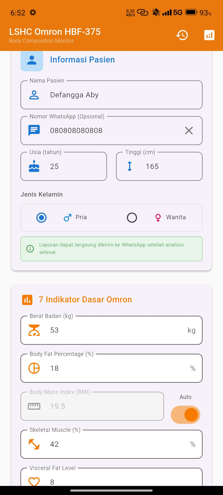
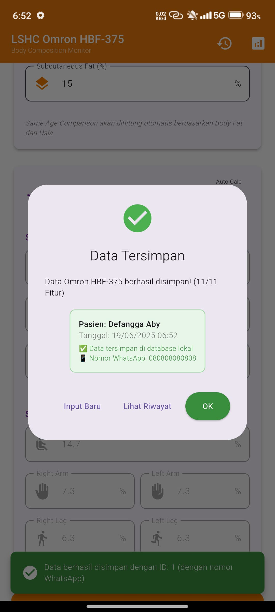
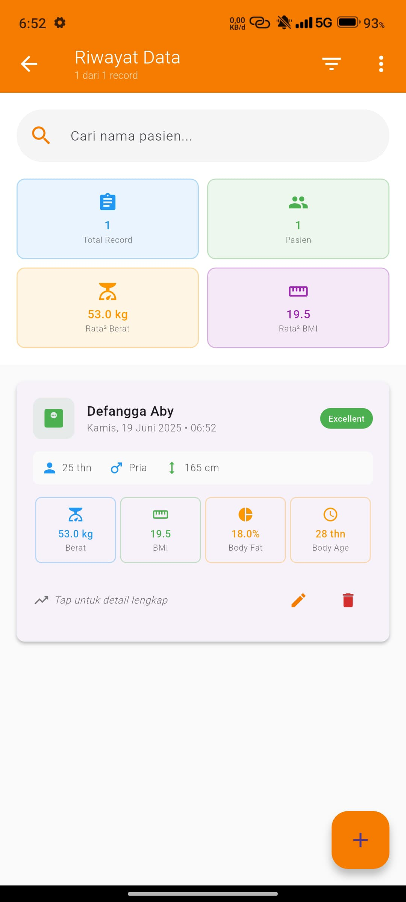
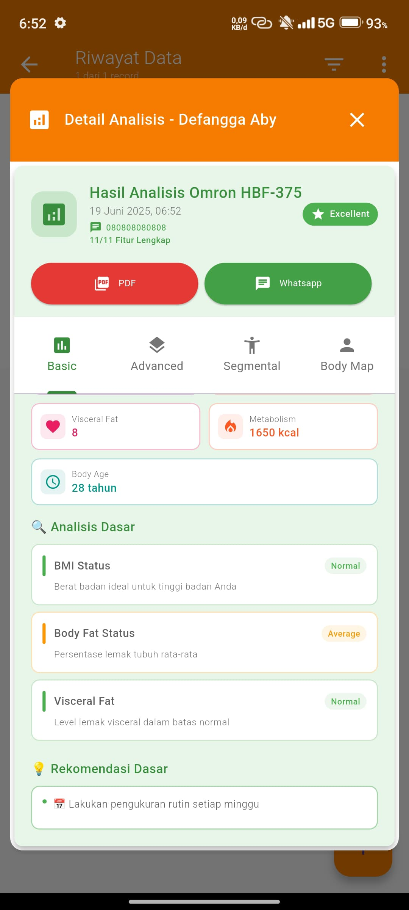
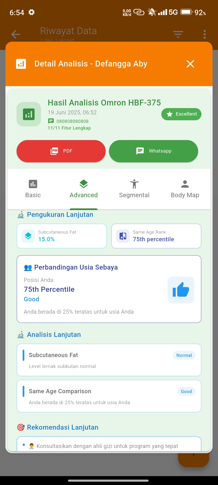
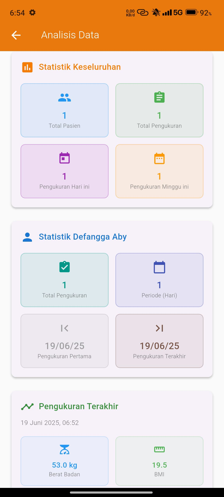

# Omron HBF-375 Body Composition Monitor App

Aplikasi Flutter untuk input manual dan analisis data lengkap dari Omron HBF-375 Body Composition Monitor dengan 11 fitur pengukuran lengkap dan integrasi WhatsApp untuk berbagi hasil.

## 📋 Deskripsi Project

LSHC Omron App adalah aplikasi mobile yang memungkinkan input manual data dari perangkat Omron HBF-375 dan memberikan analisis komprehensif dengan visualisasi yang menarik. Aplikasi ini dikembangkan khusus untuk Lampung Sport Health Center (LSHC) dengan fitur-fitur canggih untuk monitoring kesehatan.

## ✨ Fitur Utama

### 🔢 Input Data Lengkap (11 Fitur Omron HBF-375)
- **7 Indikator Dasar:**
  - Berat Badan (kg)
  - Body Fat Percentage (%)
  - BMI (Body Mass Index)
  - Skeletal Muscle Percentage (%)
  - Visceral Fat Level
  - Resting Metabolism (kcal)
  - Body Age (tahun)

- **4 Fitur Lanjutan:**
  - Subcutaneous Fat Percentage (%)
  - Segmental Subcutaneous Fat (per bagian tubuh)
  - Segmental Skeletal Muscle (per bagian tubuh)
  - Same Age Comparison (percentile)

### 📊 Analisis Komprehensif
- **Analisis Dasar:** Kategorisasi BMI, Body Fat, dan Visceral Fat
- **Analisis Lanjutan:** Perbandingan dengan usia sebaya
- **Analisis Segmental:** Distribusi lemak dan otot per bagian tubuh
- **Body Map Visualization:** Representasi visual komposisi tubuh

### 📱 Fitur WhatsApp Integration
- Input nomor WhatsApp pasien
- Berbagi hasil analisis langsung ke WhatsApp
- Template pesan otomatis dengan hasil lengkap
- Export PDF dan kirim via WhatsApp

### 📈 Manajemen Data
- Penyimpanan data lokal dengan SQLite
- Riwayat lengkap semua pengukuran
- Filter dan pencarian data
- Export data ke format CSV
- Statistik dan analisis trend

### 📄 Export & Sharing
- **PDF Report:** Laporan lengkap 5 halaman dengan:
  - Cover page dengan info pasien
  - Analisis dasar (7 indikator)
  - Analisis lanjutan
  - Analisis segmental
  - Rekomendasi dan saran
- **WhatsApp Sharing:** Kirim hasil langsung
- **General Sharing:** Berbagi ke platform lain

## 🏗️ Struktur Project

```
lib/
├── main.dart                        # Entry point aplikasi
│
├── models/
│   └── omron_data.dart             # Model data Omron dengan 11 fitur
        patient.dart
│
├── services/
│   ├── database_service.dart       # Operasi SQLite
│   ├── pdf_service.dart            # Generate laporan PDF
│   └── whatsapp_direct_service.dart# Integrasi WhatsApp
        api_service.dart
        sync_service.dart
│
├── screens/
│   ├── omron_input_screen.dart     # Input data manual
│   ├── omron_edit_screen.dart      # Edit data yang sudah ada
│   ├── history_screen.dart         # Riwayat dan filter data
│   └── analytics_screen.dart       # Statistik dan analisis data
│
├── widgets/
│   ├── patient_info_card.dart      # Info pasien + WhatsApp button
│   ├── omron_result_card.dart      # Hasil analisis (4 tab)
│   ├── omron_history_card.dart     # Card riwayat hasil input
│   ├── filter_dialog.dart          # Dialog filter riwayat
│   └── whatsapp_form_dialog.dart   # Dialog kirim hasil via WhatsApp

```

## 🛠️ Teknologi yang Digunakan

### Framework & Language
- **Flutter** 3.10.0+
- **Dart** 3.0.0+

### Dependencies
```yaml
dependencies:
  flutter:
    sdk: flutter
  sqflite: ^2.3.0              # Database SQLite
  path_provider: ^2.1.1        # File system access
  intl: ^0.19.0                # Internationalization
  pdf: ^3.10.7                 # PDF generation
  url_launcher: ^6.2.2         # URL launcher untuk WhatsApp
  share_plus: ^7.2.2           # Sharing functionality
  fl_chart: ^0.68.0            # Charts dan visualisasi
  provider: ^6.1.1             # State management
  shared_preferences: ^2.2.2   # Local preferences
  cupertino_icons: ^1.0.6      # iOS icons
```

## 🚀 Instalasi dan Setup

### Prerequisites
- Flutter SDK 3.10.0 atau lebih baru
- Dart SDK 3.0.0 atau lebih baru
- Android Studio / VS Code
- Android SDK untuk testing

### Langkah Instalasi

1. **Clone Repository**
   ```bash
   git clone <repository-url>
   cd omron-hbf375-app
   ```

2. **Install Dependencies**
   ```bash
   flutter pub get
   ```

3. **Setup Database**
   Database SQLite akan otomatis dibuat saat pertama kali menjalankan aplikasi.

4. **Run Application**
   ```bash
   flutter run
   ```

### Build untuk Production

**Android APK:**
```bash
flutter build apk --release
```

**Android App Bundle:**
```bash
flutter build appbundle --release
```

## 📱 Penggunaan Aplikasi

### 1. Input Data Manual
1. Buka aplikasi dan masuk ke halaman input
2. Isi informasi pasien (nama, usia, gender, tinggi badan)
3. **Opsional:** Masukkan nomor WhatsApp untuk fitur sharing
4. Input 7 data dasar dari display Omron HBF-375
5. Input data tambahan (subcutaneous fat)
6. Data segmental akan otomatis dihitung atau input manual
7. Klik "Hitung & Analisis" untuk melihat hasil
8. Klik "Simpan Data" untuk menyimpan ke database

### 2. Melihat Hasil Analisis
Hasil analisis terbagi dalam 4 tab:
- **Basic:** 7 indikator dasar dengan kategorisasi
- **Advanced:** Analisis lanjutan dan perbandingan usia
- **Segmental:** Distribusi per bagian tubuh
- **Body Map:** Visualisasi body composition

### 3. Export dan Sharing
- **PDF Export:** Generate laporan lengkap 5 halaman
- **WhatsApp:** Kirim hasil langsung ke nomor yang tersimpan
- **General Share:** Berbagi ke platform lain

### 4. Manajemen Data
- **History:** Lihat semua riwayat pengukuran
- **Filter:** Filter berdasarkan pasien, tanggal, dll
- **Analytics:** Statistik dan trend analysis
- **Search:** Cari data berdasarkan nama pasien

## 🎨 Features Responsive Design

Aplikasi mendukung berbagai ukuran layar:
- **Mobile:** Layout single column dengan scroll
- **Tablet:** Layout 2 kolom dengan spacing optimal
- **Desktop:** Layout side-by-side dengan hasil real-time

## 📊 Database Schema

### Tabel: omron_data
```sql
CREATE TABLE omron_data (
  id INTEGER PRIMARY KEY AUTOINCREMENT,
  timestamp INTEGER NOT NULL,
  patientName TEXT NOT NULL,
  whatsappNumber TEXT,
  age INTEGER NOT NULL,
  gender TEXT NOT NULL,
  height REAL NOT NULL,
  weight REAL NOT NULL,
  bodyFatPercentage REAL NOT NULL,
  bmi REAL NOT NULL,
  skeletalMusclePercentage REAL NOT NULL,
  visceralFatLevel INTEGER NOT NULL,
  restingMetabolism INTEGER NOT NULL,
  bodyAge INTEGER NOT NULL,
  subcutaneousFatPercentage REAL NOT NULL DEFAULT 0.0,
  segmentalSubcutaneousFat TEXT NOT NULL DEFAULT '{}',
  segmentalSkeletalMuscle TEXT NOT NULL DEFAULT '{}',
  sameAgeComparison REAL NOT NULL DEFAULT 50.0
);
```

### Indexes untuk Performance
- `idx_patient_name` pada kolom `patientName`
- `idx_timestamp` pada kolom `timestamp`
- `idx_whatsapp` pada kolom `whatsappNumber`
- `idx_patient_timestamp` pada kombinasi `patientName, timestamp`

## 🔧 Konfigurasi

### WhatsApp Integration
Untuk mengaktifkan fitur WhatsApp:
1. Pastikan `url_launcher` dependency sudah terinstall
2. Tambahkan permission di `android/app/src/main/AndroidManifest.xml`:
```xml
<uses-permission android:name="android.permission.INTERNET" />
<queries>
  <intent>
    <action android:name="android.intent.action.VIEW" />
    <data android:scheme="https" />
  </intent>
</queries>
```

### PDF Generation
PDF akan disimpan di direktori Documents device:
- Android: `/storage/emulated/0/Android/data/com.example.app/files/Documents/`
- iOS: App Documents Directory

## 🎯 Roadmap

### v1.1.0 (Planned)
- [ ] Bluetooth integration dengan Omron HBF-375
- [ ] Cloud sync dengan Firebase
- [ ] Multi-language support (EN/ID)
- [ ] Dark mode theme

### v1.2.0 (Planned)
- [ ] Advanced analytics dengan ML
- [ ] Appointment scheduling
- [ ] Patient progress tracking
- [ ] Batch data import/export

## 🤝 Contributing

1. Fork repository
2. Create feature branch (`git checkout -b feature/amazing-feature`)
3. Commit changes (`git commit -m 'Add some amazing feature'`)
4. Push to branch (`git push origin feature/amazing-feature`)
5. Open Pull Request


## 📄 License

This project is licensed under the MIT License - see the [LICENSE](LICENSE) file for details.

## 🏢 Tentang LSHC

**Lampung Sport Health Center (LSHC)** adalah pusat kesehatan olahraga yang berkomitmen memberikan layanan terbaik untuk monitoring dan analisis komposisi tubuh menggunakan teknologi terdepan.

---

**Dikembangkan dengan One Circle Software untuk kesehatan yang lebih baik**

<!-- Row 1 -->
 

<!-- Row 2 -->
 

<!-- Row 3 -->
 
